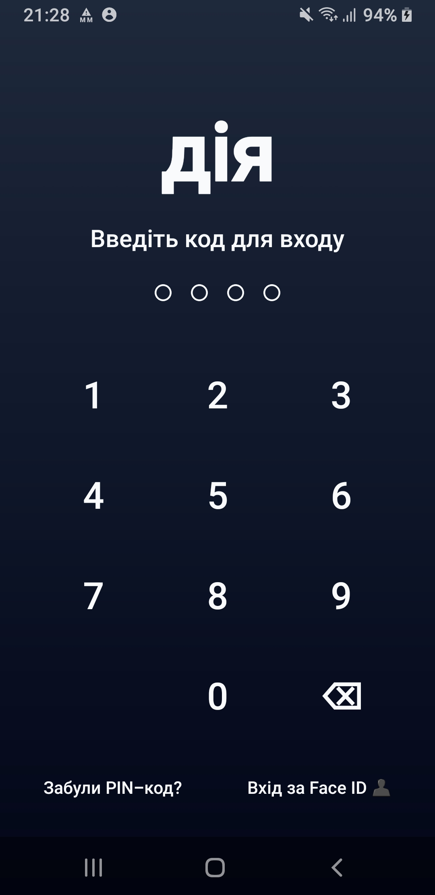
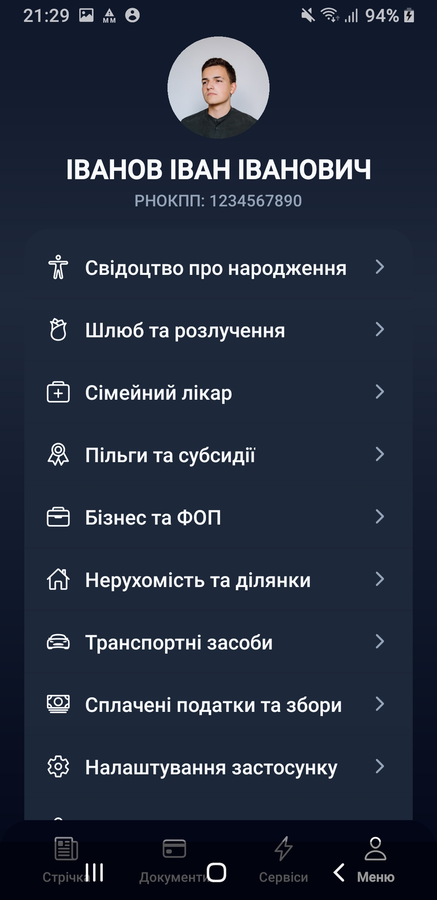
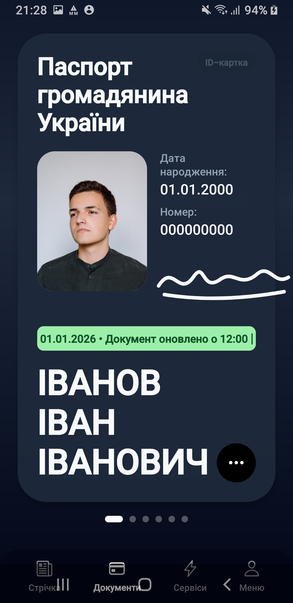

# Дія / Дия

> Цифровые документы — прямо у вас под рукой.

<div align="center">
  
  <br />
  <strong>Безопасный и удобный доступ к цифровым документам</strong>
</div>

## О проекте

**Дія / Дия** — мобильное приложение на Expo и React Native для хранения цифровых документов и доступа к основным разделам сервиса в одном месте.

Приложение поддерживает Android и web-версию, сохраняет данные локально и предлагает простой сценарий авторизации с тестовым PIN-кодом.

## Интерфейс приложения

Ниже — несколько экранов проекта: от быстрого доступа к меню до разделов с документами и новостями.

<table>
  <tr>
    <td align="center" width="50%">
      
      <br />
      <b>Главное меню</b><br />
      <sub>Быстрый переход к возможностям приложения</sub>
    </td>
    <td align="center" width="50%">
      
      <br />
      <b>Цифровые документы</b><br />
      <sub>Документы всегда доступны под рукой</sub>
    </td>
  </tr>
  <tr>
    <td align="center" width="50%">
      
      <br />
      <b>Лента новостей</b><br />
      <sub>Актуальная информация в привычном формате</sub>
    </td>
    <td align="center" width="50%">
      
      <br />
      <b>Экран блокировки</b><br />
      <sub>Дополнительный уровень защиты при запуске</sub>
    </td>
  </tr>
</table>

## Управление

Откройте:

`Меню → Бізнес та ФОП → выберите нужное изменение`

> **Важно:** стандартный Expo не собирает из этого проекта нативные приложения `.exe` для Windows и `.AppImage` / `.deb` для Linux. Для этих форматов потребуется дополнительная адаптация проекта под Electron или Tauri.

---

## Технологии

- Expo SDK 54
- React 19
- React Native 0.81
- React Native Web
- JavaScript
- `expo-image-picker`
- `expo-local-authentication`
- `@react-native-async-storage/async-storage`
- `react-native-qrcode-svg`

## Требования

Установите:

- Node.js LTS — рекомендуется версия 20 или новее;
- npm;
- Git — если проект клонируется из репозитория;
- аккаунт Expo — только для облачной сборки через EAS.

Для локального запуска Android дополнительно понадобятся Android Studio и настроенный Android SDK. Для запуска в браузере достаточно Node.js и npm.

## Установка проекта

```bash
git clone https://github.com/Ghostoraner/fake-dija.git
cd fake-dija
npm ci
```

Если `npm ci` завершается ошибкой из-за изменённого `package-lock.json`, используйте:

```bash
npm install
```

## Запуск в режиме разработки

Запустите Expo Dev Server:

```bash
npm start
```

После запуска:

- нажмите `w`, чтобы открыть приложение в браузере;
- нажмите `a`, чтобы открыть Android-версию в эмуляторе или на подключённом устройстве;
- отсканируйте QR-код приложением Expo Go для запуска на телефоне.

Также доступны команды:

```bash
npm run web       # запуск web-версии
npm run android   # запуск Android-версии
npm run ios       # запуск iOS-версии (только macOS с Xcode)
```

Тестовый PIN-код приложения: `1111`.

## Сборка web-приложения для Linux и Windows

Эта сборка создаёт статические файлы в каталоге `dist`:

```bash
npm ci
npx expo export --platform web
```

Для локальной проверки установите простой статический сервер:

```bash
npx serve dist
```

Или используйте Python:

```bash
python3 -m http.server 8080 --directory dist
```

Откройте адрес, который напечатает команда, обычно `http://localhost:3000` или `http://localhost:8080`.

## Сборка Android через EAS

EAS Build выполняется в облаке Expo, поэтому запустить его можно и из Linux, и из Windows.

```bash
npm install --global eas-cli
eas login
eas whoami
npx expo config --type public
```

Соберите APK для тестовой установки:

```bash
eas build --platform android --profile preview
```

Production-версия для Google Play:

```bash
eas build --platform android --profile production
```

Профиль `preview` из `eas.json` собирает APK, а production-профиль обычно создаёт Android App Bundle (`.aab`).

## Что можно получить на каждой ОС

| Целевая платформа | Команда | Результат |
|---|---|---|
| Linux | `npx expo export --platform web` | Web-приложение в `dist/` |
| Windows | `npx expo export --platform web` | Web-приложение в `dist/` |
| Android | `eas build --platform android --profile preview` | Устанавливаемый `.apk` |
| Google Play | `eas build --platform android --profile production` | Пакет `.aab` |
| iOS | `eas build --platform ios --profile production` | Сборка через EAS |

## Ограничения web-версии

Некоторые мобильные возможности работают в браузере иначе или недоступны полностью:

- Face ID и биометрическая авторизация зависят от возможностей браузера и устройства;
- выбор изображений открывает файловый диалог браузера;
- часть нативного поведения React Native может отличаться от Android;
- данные профиля сохраняются локально в браузере через AsyncStorage-совместимый механизм.

## Полезные команды

```bash
npx expo start --clear       # очистить кэш Metro и запустить Expo
npx expo doctor              # проверить зависимости и конфигурацию
npx expo export --platform web
eas build:list               # посмотреть сборки EAS
```

## Структура основных файлов

- `App.js` — основной экран и логика приложения;
- `app.json` — настройки Expo, имя, иконки и Android package name;
- `eas.json` — профили облачных сборок EAS;
- `assets/` — изображения и иконки приложения;
- `assets-git/` — скриншоты интерфейса для документации;
- `index.js` — точка входа приложения;
- `package.json` — зависимости и npm-скрипты.

## Лицензия

Проект распространяется по лицензии MIT. Подробности находятся в файле [LICENSE](./LICENSE).
